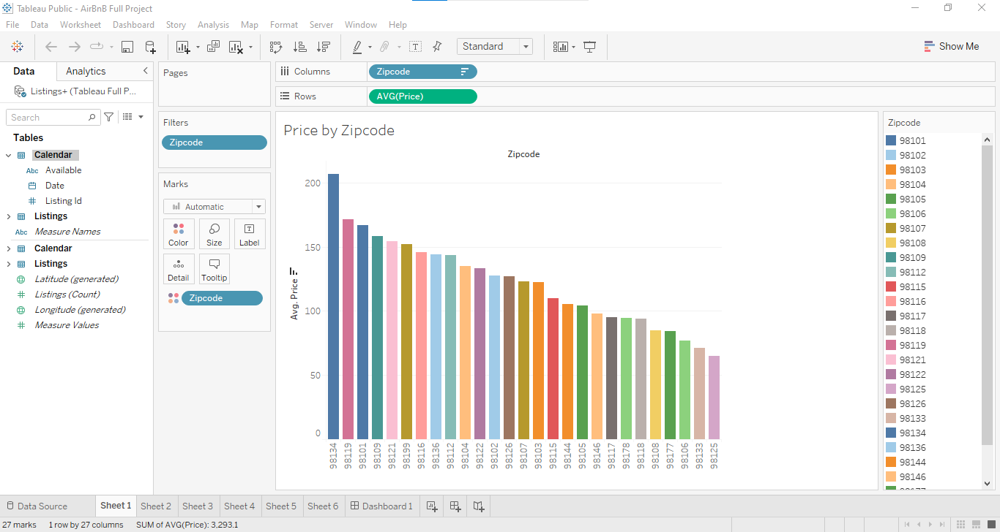
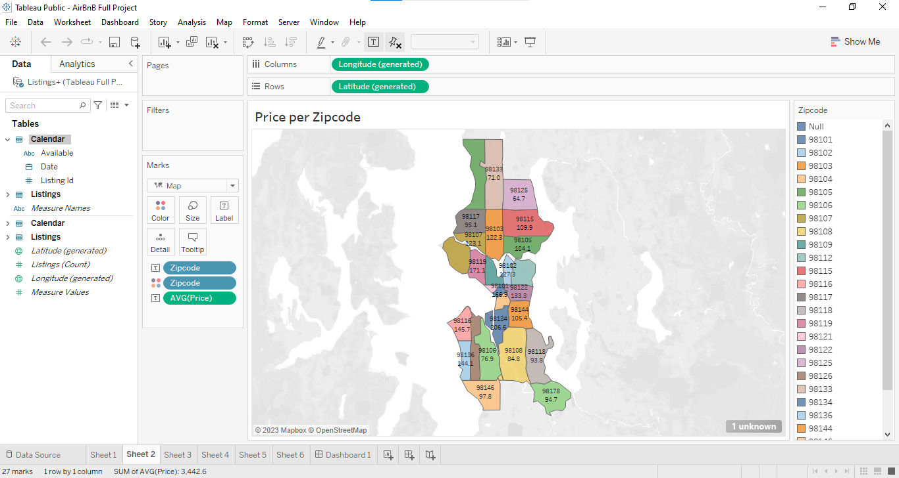
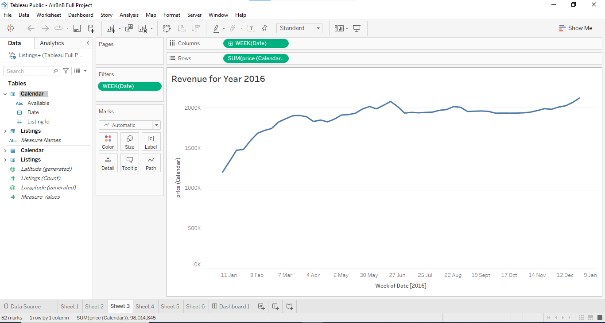
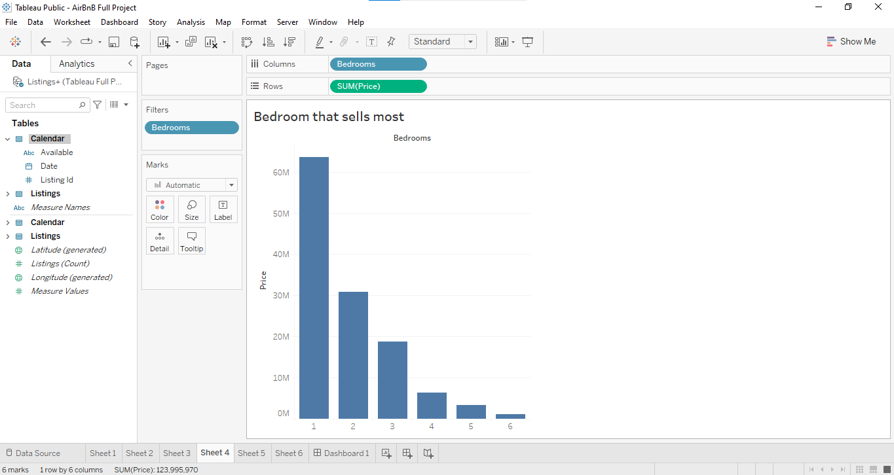
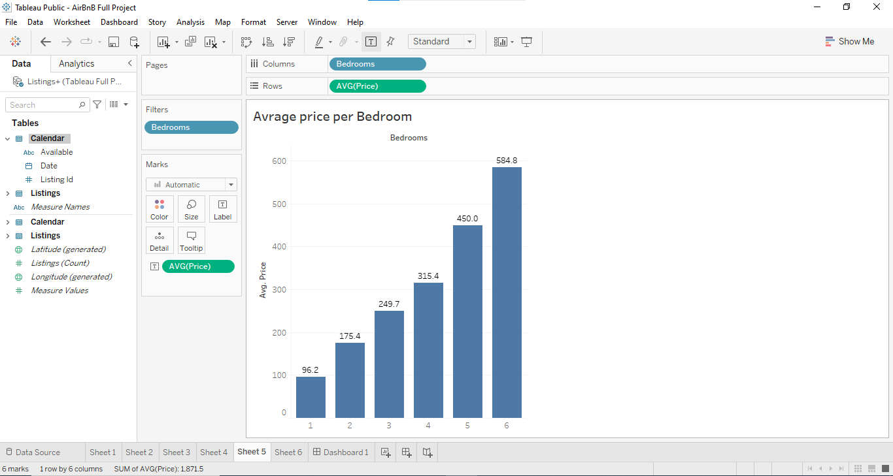
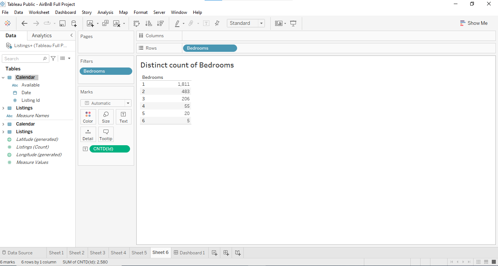
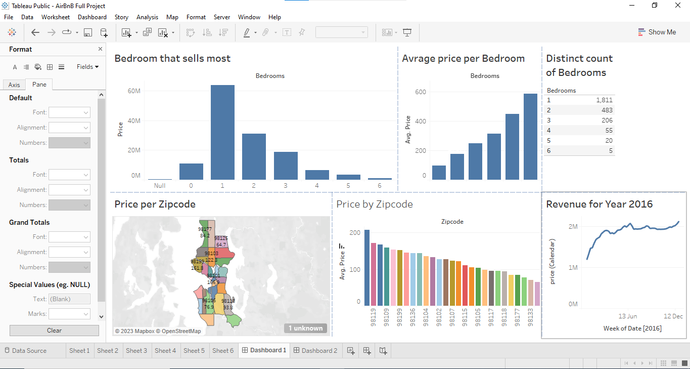

# Tableau Visualization Project 

## The Airbnb market in Seattle for the year 2016

## Problem Statemtent

The Airbnb market in Seattle for the year 2016 presents an opportunity for data-driven insights and optimization. This project aims to address key questions and provide actionable recommendations for hosts and potential investors in the Seattle Airbnb business. Leveraging two core datasets, the listing table and the calendar table, I have performed an INNER JOIN to create a unified dataset, enabling comprehensive analysis.

- Average Price per Zip Code
- Best Time for Airbnb Market Entry (Revenue)
- Highest Earning Bedroom
- Average Price per Bedroom
- Competition Analysis by Bedroom Type

## Solution

- Average Price per Zip Code

Average Price by Zip Code              |    Average Price by Zip Code(Map)
:--------------------------------------|:--------------------------:
               | 

This shows the variation in average prices across different zip codes. This is crucial for hosts to set competitive rates and for investors to identify profitable areas.

- Best Time for Airbnb Market Entry (Revenue)

Determining the optimal time of year to list properties can significantly impact revenue. It shows that summer time and the end of the year are the  peak booking periods. 

- Highest Earning Bedroom

This shows that the most money made is with one bedroom 

- Average Price per Bedroom

Calculating the average price per bedroom provides insights into pricing strategies and helps hosts evaluate their property's earning potential.

- Competition Analysis by Bedroom Type

This shows the number of listings made for each bedroom, and it shows one bedroom have the biggest competition

## Dashboard

You can interact with the report [HERE](https://public.tableau.com/app/profile/olatayo.dipe/viz/SeattleAirBnB_16957620719150/Dashboard1?publish=yes)

## Summary

I  uncovered the secrets of Seattle's Airbnb success by determining the average prices per zip code, identifying the best timing for listing properties to maximize revenue, highlighting  the most lucrative bedroom, and evaluating the competition for each bedroom type. This project serves as a strategic compass, guiding stakeholders towards increased profitability and enhanced competitiveness in the vibrant Airbnb ecosystem of 2016.

